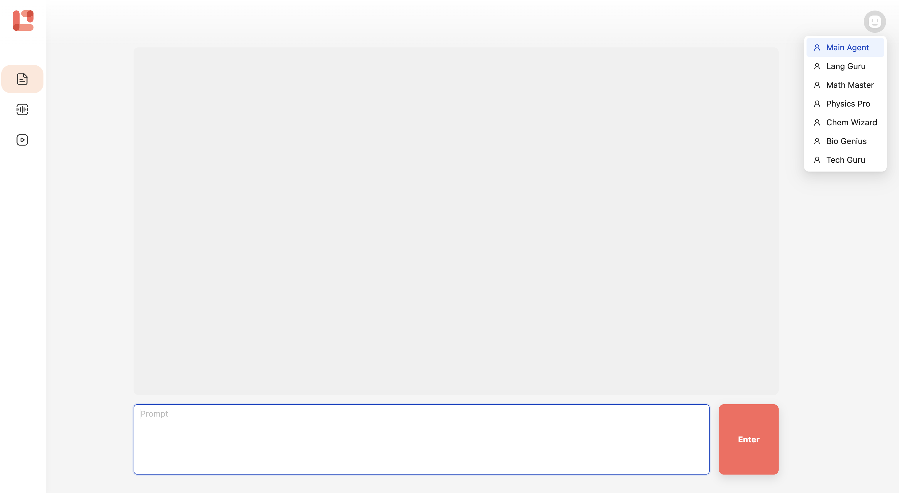

# LermoAI

***AI Agent for Personalized Learning***

LermoAI is an open-source project that aims to revolutionize the way you learn. By generating personalized content tailored to your preferences, LermoAI ensures that your learning experience is both efficient and enjoyable. Whether you prefer reading articles, listening to podcasts, or watching videos, LermoAI creates custom learning materials just for you. Choose your AI agent and embark on a learning journey that's perfectly suited to your needs.



# Features

- [x] AI Agent
- [x] Article Generation
- [x] Podcast Generation
- [x] LLM
  - [x] OpenAI
  - [x] Mistral
  - [x] Llama
  - [ ] Groq
  - [ ] Claude
- [ ] Learning Path
- [ ] Chat Agent
- [ ] Video Generation
- [ ] Custom Agent
- [ ] Search Agent

# Getting Started

### Requirements

- Node.js
- Next.js
- React
- Python

### Web

To set up the frontend:

```sh
cd apps/frontend/apps/lermo-gen-web

# Install Dependencies
pnpm i

# Start
pnpm run dev
```

### API

To set up the API:

```sh
cd apps/api/core-api

# Install Dependencies
pip install -r requirements.txt
pip install git+https://github.com/myshell-ai/MeloTTS.git
python -m unidic download

# Start
python main.py
```

### LLM

LermoAI supports both OpenAI and self-hosted LLMs such as Llama and Mistral. For more details, refer to the [LLM README](apps/llm/README.md).

### Docker Setup

Edit the environment variables to use either OpenAI or your self-hosted LLM:

```yaml
# OpenAI
args:
  - OPENAI_API_BASE=https://api.openai.com/v1
  - OPENAI_API_KEY=sk-proj-xxx

# Hugging Face
args:
  - OPENAI_API_BASE=https://llama-cpp.hf.space
  - OPENAI_API_KEY=llama-key
```

To start the Docker containers:

```sh
docker-compose up
```

# Free and Open for Everyone

At Lermo, we believe in making education accessible to all. That's why it is completely free and open for everyone to use. We aim to democratize education and provide equal opportunities for all learners.

# Support Us

Contributor: We are currently building a small group of contributors for this project as it is still in its initial stages. We welcome individuals who are interested in joining our team and contribute to the development and improvement of this project. Please reach out to us at contact@lermo.io to express your interest and discuss potential contributions.

Sponsorship: We are planning to utilize platforms such as Github Sponsors, Patreon, and buymeacoffee to gather financial support for this project. Your sponsorship will greatly assist us in furthering our mission of changing the education system. Stay tuned for more information on how you can sponsor and support our project through these platforms.

# Lermo Mission

"Picture a groundbreaking education system that transcends barriers, offering boundless access to knowledge for all. It embodies inclusivity and equality, empowering learners worldwide to embrace their potential and pursue dreams without constraints. In this educational utopia, knowledge fuels curiosity, ignites intellect, and fosters a love for learning, shaping a brighter, enlightened future for humanity. Let's dare to envision and strive for an education system that belongs to everyone—a beacon of hope and empowerment, inspiring generations to flourish and make a positive impact."